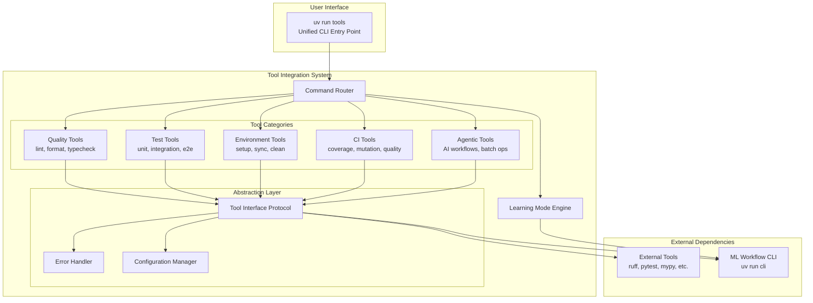

# Design Document

## Overview

This design document outlines the technical approach for integrating the external tooling from the `tools/` directory into the `ml_playground` module. The integration will provide a unified CLI accessible via `uv run tools`, implement a learning mode for educational purposes, and maintain CI independence while following the project's established patterns for error handling, configuration, and code organization.

## Important Development Constraint

The base branch is currently working on removing all BasedPyright warnings and errors in strict mode. This design accounts for this constraint:

- **New `ml_playground/tools/` module will be built to strict mode standards from the start**
- **No modifications to existing codebase outside the tools module during initial phases**
- **Integration with existing modules (like `cli.py`) is deferred until base branch work is complete**
- **This approach avoids merge conflicts and ensures clean integration when rebasing**

## Development Workflow

**Task Workflow Requirements**:

1. **Pre-Task**: Check for base branch updates and rebase to stay current with the parallel strict mode work
2. **Post-Task**: Create a commit with the completed work following project commit standards

This workflow ensures:

- Continuous integration with base branch improvements
- Early detection of any conflicts
- Alignment with evolving strict mode standards
- Granular, reviewable commit history
- Quality gates passing for each increment
- Smooth final integration when base branch work is complete

## Architecture

### High-Level Architecture



### Shared Infrastructure (Future Integration)

The tool integration system will provide shared infrastructure designed for future reuse by the existing ML workflow CLI:

- **ToolResult**: A standardized result object designed for all CLI operations (tools, prepare, train, sample)
- **LearningMode**: Educational output engine designed to explain both development tools and ML workflow commands
- **Error Handling**: Consistent error reporting patterns ready for adoption by other CLI systems
- **Configuration**: Unified configuration management patterns ready for broader adoption

**Note**: While this infrastructure is designed for sharing, integration with the existing ML workflow CLI is deferred until the base branch strict mode work is complete.

### Module Structure

The integrated tooling will be organized within the `ml_playground` module as follows:

```
src/ml_playground/
├── tools/                          # New integrated tooling module
│   ├── __init__.py                 # Tool system initialization
│   ├── cli.py                      # Main CLI entry point (uv run tools)
│   ├── core/                       # Core tooling infrastructure (shared with cli.py)
│   │   ├── __init__.py
│   │   ├── interfaces.py           # Tool interface protocols & ToolResult
│   │   ├── errors.py              # Tool-specific error types
│   │   ├── config.py              # Tool configuration management
│   │   ├── learning_mode.py       # Learning mode (usable by cli.py too)
│   │   └── runner.py              # Tool execution engine
│   ├── categories/                 # Tool category implementations
│   │   ├── __init__.py
│   │   ├── quality.py             # Linting, formatting, type checking
│   │   ├── testing.py             # Test execution and reporting
│   │   ├── environment.py         # Environment management
│   │   ├── ci.py                  # CI/CD operations
│   │   └── agentic.py             # AI-assisted development tools
│   └── utils/                      # Shared utilities
│       ├── __init__.py
│       ├── subprocess_utils.py     # Process execution helpers
│       ├── path_utils.py          # Path and file utilities
│       └── output_formatters.py   # Output formatting utilities
```

## Components and Interfaces

### Core Interfaces

#### Tool Interface Protocol

```python
from typing import Protocol, Any, Dict, List, Optional
from pathlib import Path
from ml_playground.core.error_handling import MLPlaygroundError

class ToolInterface(Protocol):
    """Protocol defining the interface for all integrated tools."""
    
    @property
    def category(self) -> str:
        """The tool category (e.g., 'ci', 'quality', 'test')."""
        ...
    
    @property
    def command(self) -> str:
        """The specific command name (e.g., 'coverage-test', 'lint')."""
        ...
    
    @property
    def description(self) -> str:
        """A brief description of what the tool does."""
        ...
    
    def execute(
        self, 
        args: List[str], 
        *, 
        learning_mode: bool = False,
        verbosity_level: int = 0,
        dry_run: bool = False
    ) -> ToolResult:
        """Execute the tool with the given arguments.
        
        The returned ToolResult will have operation_id automatically
        generated as f"tools.{self.category}.{self.command}".
        """
        ...
    
    def get_help(self) -> str:
        """Return help text for the tool."""
        ...
    
    def validate_args(self, args: List[str]) -> None:
        """Validate arguments before execution."""
        ...

from pydantic import BaseModel, Field, validator
from typing import Literal

class OperationId(BaseModel):
    """Structured operation identifier with validation."""
    
    namespace: Literal["tools", "ml"] = Field(..., description="Operation namespace")
    category: str = Field(..., description="Operation category (e.g., 'ci', 'quality', 'prepare')")
    command: str = Field(..., description="Specific command (e.g., 'coverage-test', 'lint', 'shakespeare')")
    
    @validator('category')
    def validate_category(cls, v, values):
        """Validate category based on namespace."""
        namespace = values.get('namespace')
        if namespace == 'tools':
            valid_categories = {'ci', 'quality', 'test', 'env', 'agentic'}
            if v not in valid_categories:
                raise ValueError(f"Invalid tools category: {v}. Must be one of {valid_categories}")
        elif namespace == 'ml':
            valid_categories = {'prepare', 'train', 'sample', 'analyze'}
            if v not in valid_categories:
                raise ValueError(f"Invalid ml category: {v}. Must be one of {valid_categories}")
        return v
    
    @validator('command')
    def validate_command_format(cls, v):
        """Ensure command follows kebab-case naming."""
        if not v.replace('-', '').replace('_', '').isalnum():
            raise ValueError(f"Command must be alphanumeric with hyphens/underscores: {v}")
        return v
    
    def __str__(self) -> str:
        """Generate the dot-separated operation ID."""
        return f"{self.namespace}.{self.category}.{self.command}"

class ToolResult(BaseModel):
    """Result of tool execution with validated operation identification.
    
    This class can be reused by the existing ML workflow CLI (cli.py)
    for consistent result handling across all CLI operations.
    """
    
    success: bool
    exit_code: int
    stdout: str = ""
    stderr: str = ""
    learning_info: LearningInfo = Field(default_factory=lambda: LearningInfo([], [], [], []))
    operation_id: OperationId
    
    @classmethod
    def create(
        cls,
        success: bool,
        exit_code: int,
        namespace: Literal["tools", "ml"],
        category: str,
        command: str,
        stdout: str = "",
        stderr: str = "",
        learning_info: LearningInfo = Field(default_factory=lambda: LearningInfo([], [], [], []))
    ) -> "ToolResult":
        """Factory method to create ToolResult with validated operation_id."""
        operation_id = OperationId(
            namespace=namespace,
            category=category,
            command=command
        )
        return cls(
            success=success,
            exit_code=exit_code,
            stdout=stdout,
            stderr=stderr,
            learning_info=learning_info,
            operation_id=operation_id
        )

class LearningInfo(BaseModel):
    """Educational information about tool execution."""
    
    commands_executed: List[str] = Field(default_factory=list)
    explanations: List[str] = Field(default_factory=list)
    best_practices: List[str] = Field(default_factory=list)
    related_concepts: List[str] = Field(default_factory=list)
```

#### Learning Mode Engine

```python
from enum import Enum
from typing import List, Dict, Any

class VerbosityLevel(Enum):
    """Learning mode verbosity levels."""
    MINIMAL = 0      # "I just want to see what the current implementation is" - minimal command display
    STANDARD = 1     # Balanced explanations with some context
    COMPREHENSIVE = 2 # "I am new to all of this" - comprehensive explanations

class LearningModeEngine:
    """Manages educational output and explanations."""
    
    def __init__(self, verbosity: VerbosityLevel = VerbosityLevel.STANDARD):
        self.verbosity = verbosity
    
    def explain_command(
        self, 
        command: str, 
        context: str,
        category: str
    ) -> LearningInfo:
        """Generate educational information for a command."""
        ...
    
    def format_output(
        self, 
        tool_result: ToolResult,
        learning_enabled: bool
    ) -> str:
        """Format tool output with optional learning information."""
        ...
```

### Error Handling

Following the existing `MLPlaygroundError` pattern, we'll define tool-specific error types:

```python
from ml_playground.core.error_handling import MLPlaygroundError

class ToolExecutionError(MLPlaygroundError):
    """Raised when tool execution fails."""
    pass

class ToolConfigurationError(MLPlaygroundError):
    """Raised when tool configuration is invalid."""
    pass

class EnvironmentSetupError(MLPlaygroundError):
    """Raised when environment setup fails."""
    pass

class DependencyError(MLPlaygroundError):
    """Raised when required dependencies are missing."""
    pass
```

### Configuration Management

Tool configuration will follow the existing TOML-based pattern with explicit timeout management:

**Timeout Philosophy**: There is no such thing as an infinite timeout. All timeouts should be short and based on the specific operation and environment. Choose the timeout we want to achieve when everything is working correctly. If we hit the timeout, it's a good indicator that one of our assumptions about the current environment is wrong. This principle should be added to the development guidelines.

```python
from pydantic import BaseModel
from typing import Dict, Any, Optional
from pathlib import Path

class ToolConfig(BaseModel):
    """Base configuration for all tools."""
    enabled: bool = True
    timeout: int = Field(
        default=300,  # 5 minutes - explicit timeout based on expected operation duration
        description="Timeout in seconds. No infinite timeouts - choose based on expected operation duration and environment"
    )
    environment_vars: Dict[str, str] = {}
    
class QualityToolsConfig(ToolConfig):
    """Configuration for quality tools (lint, format, typecheck)."""
    timeout: int = Field(
        default=120,  # 2 minutes - linting/formatting should be fast
        description="Timeout for quality tools - should complete quickly in normal environments"
    )
    ruff_config_path: Optional[Path] = None
    mypy_config_section: str = "tool.mypy"
    basedpyright_config_section: str = "tool.pyright"
    
class TestToolsConfig(ToolConfig):
    """Configuration for testing tools."""
    timeout: int = Field(
        default=600,  # 10 minutes - tests can take longer but should have reasonable bounds
        description="Timeout for test execution - based on expected test suite duration"
    )
    pytest_args: List[str] = []
    coverage_threshold: float = 0.0
    parallel_workers: int = -1  # auto-detect
    
class ToolsConfig(BaseModel):
    """Main configuration for the tool integration system."""
    quality: QualityToolsConfig = QualityToolsConfig()
    testing: TestToolsConfig = TestToolsConfig()
    environment: ToolConfig = ToolConfig()
    ci: ToolConfig = ToolConfig()
    agentic: ToolConfig = ToolConfig()
    
    learning_mode_default: bool = False
    default_verbosity: int = 1
```

## Data Models

### Command Structure

The unified CLI will organize commands in a hierarchical structure:

```
uv run tools
├── quality                    # Code quality tools
│   ├── lint                  # Run linting checks
│   ├── format                # Format code
│   ├── typecheck             # Run type checking
│   └── all                   # Run all quality checks
├── test                      # Testing tools
│   ├── unit                  # Run unit tests
│   ├── integration           # Run integration tests
│   ├── e2e                   # Run end-to-end tests
│   ├── acceptance            # Run acceptance tests
│   ├── property              # Run property-based tests
│   ├── coverage              # Generate coverage reports
│   └── all                   # Run all tests
├── env                       # Environment management
│   ├── setup                 # Set up development environment
│   ├── sync                  # Sync dependencies
│   ├── verify                # Verify installation
│   ├── clean                 # Clean caches and artifacts
│   └── info                  # Show environment information
├── ci                        # CI/CD operations
│   ├── quality-gate          # Run full quality gate
│   ├── mutation              # Mutation testing
│   ├── badges                # Generate badges
│   └── local                 # Run CI locally
├── agentic                   # AI-assisted development
│   ├── guidelines            # Set up AI guidelines
│   ├── batch-review          # Batch review operations
│   └── workflow              # AI workflow helpers
└── learn                     # Learning mode utilities
    ├── commands              # Show available commands
    ├── explain <command>     # Explain a specific command
    └── best-practices        # Show best practices guide
```

### Configuration Schema

Tool configuration will be embedded in the existing `pyproject.toml`:

```toml
[tool.ml_playground.tools]
learning_mode_default = false
default_verbosity = 1

[tool.ml_playground.tools.quality]
enabled = true
timeout = 300
ruff_config_path = "pyproject.toml"

[tool.ml_playground.tools.testing]
enabled = true
coverage_threshold = 87.0
parallel_workers = -1
pytest_args = ["-v", "--strict-markers"]

[tool.ml_playground.tools.environment]
enabled = true

[tool.ml_playground.tools.ci]
enabled = true

[tool.ml_playground.tools.agentic]
enabled = true
```

## Error Handling

### Error Hierarchy

```python
# Tool-specific errors inheriting from MLPlaygroundError
class ToolExecutionError(MLPlaygroundError):
    """Base class for tool execution failures."""
    pass

class CommandNotFoundError(ToolExecutionError):
    """Raised when a requested command is not found."""
    pass

class InvalidArgumentError(ToolExecutionError):
    """Raised when invalid arguments are provided."""
    pass

class DependencyMissingError(ToolExecutionError):
    """Raised when required dependencies are not available."""
    pass

class TimeoutError(ToolExecutionError):
    """Raised when tool execution times out."""
    pass
```

### Error Context and Recovery

Each error will include structured information following the existing pattern:

```python
def handle_tool_failure(command: str, exit_code: int, stderr: str) -> None:
    """Handle tool execution failure with structured error information."""
    
    if "command not found" in stderr.lower():
        raise CommandNotFoundError(
            f"Tool command '{command}' not found",
            reason="External tool binary is not available in PATH",
            rationale="All required tools must be installed and accessible for the development workflow to function"
        )
    
    if exit_code == 2:  # Common exit code for argument errors
        raise InvalidArgumentError(
            f"Invalid arguments provided to '{command}'",
            reason=f"Tool exited with code {exit_code} indicating argument problems",
            rationale="Tool arguments must be validated before execution to ensure predictable behavior"
        )
    
    # Generic execution error
    raise ToolExecutionError(
        f"Tool '{command}' failed with exit code {exit_code}",
        reason=f"External process returned non-zero exit code {exit_code}",
        rationale="Tool execution must succeed for the development workflow to proceed reliably"
    )
```

## Testing Strategy

Following the existing ultra-strict testing standards with 100% coverage requirements and TDD discipline:

### Unit Testing (Primary Coverage Source)

- **Speed**: Each test <10ms, lightning fast execution
- **Isolation**: No external tool dependencies - use dependency injection with fakes
- **Coverage**: 100% line and branch coverage requirement (NO EXCEPTIONS)
- **Structure**: `tests/unit/tools/` mirroring `src/ml_playground/tools/` layout
- **Property-based first**: Start with Hypothesis properties, add example tests for clarity
- **NO MOCKING**: Strictly forbidden - no `unittest.mock`, `pytest_mock`, `MagicMock`, `patch(`, or `monkeypatch`
- **Dependency injection and fakes only**: Use lightweight in-memory fakes and DI seams in production code

### Property-Based Testing

- **Framework**: Hypothesis for all new test efforts
- **Determinism**: Fixed seeds via conftest.py, <10ms budget per property
- **Strategy**: Custom `@st.composite` strategies for tool arguments and configurations
- **Organization**: `tests/property/tools/test_<subject>_property.py`

### Integration Testing (Minimal, Fast)

- **Scope**: 2-3 real components maximum, <100ms each
- **Focus**: Tool category coordination, configuration loading, CLI routing
- **No external services**: In-memory or ephemeral resources only
- **Markers**: Use `@pytest.mark.integration` for CI selection

### End-to-End Testing (Discouraged, Approval Required)

- **Constraint**: <30s total runtime, recorded/replayed I/O
- **Scope**: Only critical CLI workflows that cannot be tested at lower levels
- **Configuration**: Use `tests/e2e/ml_playground/experiments/test_default_config.toml`

### Test Organization

```
tests/
├── unit/tools/                     # Primary coverage source
│   ├── test_cli.py                # CLI entry point tests
│   ├── core/                      # Core infrastructure tests
│   │   ├── test_interfaces.py     # Protocol and result tests
│   │   ├── test_errors.py         # Error handling tests
│   │   ├── test_learning_mode.py  # Learning mode engine tests
│   │   └── test_runner.py         # Tool execution tests
│   ├── categories/                # Tool category tests
│   │   ├── test_quality.py        # Quality tools tests
│   │   ├── test_testing.py        # Test tools tests
│   │   ├── test_environment.py    # Environment tools tests
│   │   ├── test_ci.py             # CI tools tests
│   │   └── test_agentic.py        # Agentic tools tests
│   └── utils/                     # Utility tests
├── property/tools/                # Property-based tests
│   ├── test_tool_execution_property.py
│   ├── test_configuration_property.py
│   └── test_learning_mode_property.py
├── integration/tools/             # Minimal integration tests
│   ├── test_cli_integration.py
│   └── test_tool_coordination.py
└── e2e/tools/                     # End-to-end tests (if approved)
    └── test_critical_workflows.py
```

### Test Requirements

- **TDD**: Write failing test first, implement minimal code, refactor
- **No test-specific code paths**: Production code must never contain test-only branches
- **Deterministic**: All tests must pass 100% reliably, zero flaky test tolerance
- **NO MOCKING**: Absolutely no `unittest.mock`, `pytest_mock`, `MagicMock`, `patch(`, or `monkeypatch`
- **Dependency injection and fakes only**: Use lightweight in-memory fakes and DI seams in production code
- **External boundaries**: For subprocess, filesystem, time - use deterministic fakes or seamable adapters
- **Coverage gates**: 100% line and branch coverage from unit + property suites only

## Implementation Phases

### Phase 1: Core Infrastructure
- Implement core interfaces and protocols (ToolInterface, ToolResult, OperationId)
- Set up error handling system with MLPlaygroundError integration
- Create configuration management with explicit timeouts
- Implement basic CLI structure and command routing

### Phase 2: Testing and Quality Tools (Priority for Self-Validation)
- Implement testing tools (unit, integration, e2e, property, coverage)
- Implement quality tools (lint, format, typecheck)
- Migrate existing functionality from tools/ci_tasks.py and tools/lint_tasks.py
- Use these tools to validate subsequent phases

### Phase 3: Environment and CI Tools
- Implement environment tools (setup, sync, clean, verify)
- Implement CI tools (quality gates, mutation testing, badges)
- Migrate existing functionality from tools/env_tasks.py and tools/test_tasks.py
- Update GitHub Actions workflows to use new tools

### Phase 4: Learning Mode Infrastructure
- Implement learning mode engine with verbosity levels
- Add educational content for testing and quality tools
- Implement command explanation system
- Add best practices documentation

### Phase 5: Agentic Tools
- Implement AI-assisted development tools
- Add batch operation capabilities
- Create structured output formats
- Implement workflow helpers

### Phase 6: Complete Tools Module
- Finalize all tool categories within the `ml_playground/tools/` module
- Add comprehensive educational content for all tools
- Ensure the tools module is fully functional and self-contained

### Phase 7: Update CI and Documentation (Tools Only)
- Update GitHub Actions workflows to use `uv run tools` commands
- Update documentation references to new tool commands
- Keep changes focused on tooling references only

### Phase 8: FUTURE - ML Workflow CLI Integration (Post Base Branch Merge)
- **DEFERRED**: Refactor existing `cli.py` to use shared ToolResult infrastructure
- **DEFERRED**: Add learning mode support to prepare, train, sample, and analyze commands
- **DEFERRED**: Integrate shared error handling patterns
- **DEFERRED**: Add comprehensive ML workflow explanations

**Note**: Phase 8 is explicitly deferred until after the base branch strict mode work is complete to avoid merge conflicts.